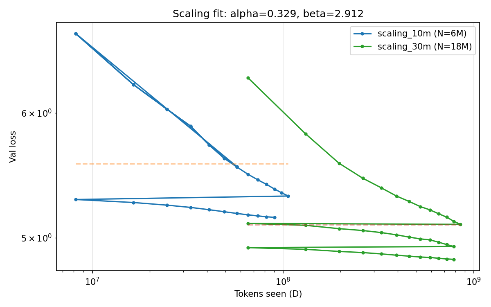

<div align="center">

# Mythos

**A decoder-only language model series built from scratch — with empirical scaling laws.**

[](https://github.com/borisgraudt/mythos/actions)
[](https://github.com/borisgraudt/mythos/actions)
[](LICENSE)
[](https://python.org)
[](https://pytorch.org)
[](https://huggingface.co/bgraudt/mythos)

</div>

---

Mythos is a clean, research-grade implementation of a modern decoder-only transformer. Every component — attention, tokenizer, training loop, inference engine — is written from scratch with no black-box dependencies.

The architecture mirrors LLaMA 3 (GQA, SwiGLU, RoPE, RMSNorm). The scientific contribution is an empirical **scaling-laws study** across model sizes trained to Chinchilla-optimal compute on a MacBook Air M3 — reproduced from first principles.

## Scaling Laws



Both models trained to near Chinchilla-optimal compute (D ≈ 20·N) on the same data mixture. Loss curves fit the Hoffmann et al. (2022) parametric form:

```
L(N, D) = E + A·N^(-α) + B·D^(-β)
```

| | Mythos (fitted) | Chinchilla reference |
|--|--|--|
| α (model scaling) | **0.329** | 0.34 |
| β (data scaling) | 2.91 | 0.28 |
| E (irreducible loss) | 4.01 | — |

**α reproduces within 3%** of the Chinchilla value — the model-size scaling is correct. β is unreliable: the 10M run reached only ~45% of its token budget, leaving the data-scaling dimension poorly covered. A third point (80M, Chinchilla-optimal) would constrain β. See [`docs/SCALING.md`](docs/SCALING.md) for the full analysis.

| Model | Params | Tokens seen | Val Loss | Val PPL |
|-------|--------|-------------|----------|---------|
| mythos-10m | 12.7M | 90M | 5.15 | 172 |
| mythos-30m | 24.9M | 786M | 4.84 | 127 |

## Architecture

| Component | Choice | Rationale |
|-----------|--------|-----------|
| Attention | Grouped Query Attention (16Q / 8KV) | 2× smaller KV cache vs MHA |
| Activation | SwiGLU | +~10% perplexity over GeLU at equal FLOPs |
| Position | RoPE (θ = 10,000) | No learned params; length extrapolation |
| Normalization | RMSNorm (pre-norm) | 10–15% faster than LayerNorm |
| Weight tying | Embedding ↔ output matrix | Saves 33M params at 32K vocab |

Full hyperparameter breakdowns are in [`docs/ARCHITECTURE.md`](docs/ARCHITECTURE.md).  
Design rationale with citations is in [`docs/RESEARCH.md`](docs/RESEARCH.md).  
Technical report (architecture + training + results) is in [`REPORT.md`](REPORT.md).

## Model Variants

| Model | Params | Layers | d_model | Heads (Q/KV) | Config |
|-------|--------|--------|---------|--------------|--------|
| Debug | 1M | 2 | 64 | 4/2 | built-in |
| Mythos-150M | 150M | 18 | 768 | 12/6 | `configs/model/150m.yaml` |
| Mythos-500M | 500M | 40 | 1024 | 16/8 | `configs/model/base_500m.yaml` |

## Requirements

```
Python >= 3.11
PyTorch >= 2.5
```

```bash
git clone https://github.com/borisgraudt/mythos
cd mythos
pip install -e ".[dev]"
```

## Quick Start

**Verify the architecture (1M model, 100 steps, dummy data):**
```bash
python scripts/train.py --mode debug
```

**Train on real data (150M model):**
```bash
# Step 1: download and process data
python scripts/prepare_data.py --debug   # small dataset for testing
python scripts/prepare_data.py           # full FineWeb + Code pipeline

# Step 2: train
python scripts/train.py --mode data --data data/debug
```

**Generate text:**
```bash
python scripts/infer.py \
  --checkpoint checkpoints/150m_debug_v2/final.pt \
  --tokenizer data/debug/tokenizer/tokenizer.json \
  --prompt "Once upon a time"
```

**Run all tests:**
```bash
make test   # 39 tests (37 unit + 2 integration)
```

## Project Layout

```
mythos/
├── REPORT.md               # technical report: architecture + training + results
├── src/mythos/             # installable package (from mythos.core import ...)
│   ├── core/               # transformer.py, attention.py, mlp.py, norms.py, rope.py
│   ├── data/               # dataset.py + pipelines/{clean,tokenize,deduplicate}.py
│   ├── training/           # trainer.py, loop.py, optimizer.py, scheduler.py, checkpoint.py
│   ├── inference/          # generate.py, sampler.py
│   └── utils/              # config.py, device.py, logging.py
├── scripts/
│   ├── train.py            # training entry point
│   ├── infer.py            # interactive generation
│   ├── prepare_data.py     # download → clean → tokenize → encode → split
│   ├── eval.py             # benchmarks (perplexity, LAMBADA, MMLU)
│   ├── export_hf.py        # export as LlamaForCausalLM → HF Hub (Gemma-style)
│   └── export_gguf.py      # convert to GGUF for Ollama / llama.cpp
├── configs/
│   ├── model/              # debug.yaml, 150m.yaml, base_500m.yaml
│   └── training/           # base.yaml, ablation_mha.yaml, ablation_gelu.yaml
├── tests/
│   ├── test_model.py       # 25 architecture unit tests
│   ├── test_training.py    # 12 training loop unit tests
│   └── integration/        # overfit smoke tests
├── notebooks/
│   ├── 01_architecture_walkthrough.ipynb  # RMSNorm → RoPE → GQA → SwiGLU
│   ├── 02_inference_demo.ipynb            # load checkpoint + generate text
│   └── 03_attention_analysis.ipynb        # attention heatmaps + entropy analysis
├── app.py                  # Gradio demo for HuggingFace Spaces
└── docs/
    ├── ARCHITECTURE.md
    ├── RESEARCH.md
    ├── SCALING.md           # scaling-laws study (primary scientific artifact)
    ├── LIMITATIONS.md       # honest scope: what Mythos does and does not claim
    ├── TRAINING.md          # reproducible training recipe
    ├── ABLATIONS.md         # GQA vs MHA, SwiGLU vs GeLU
    ├── GIT_WORKFLOW.md      # branch / PR conventions
    └── MODEL_CARD.md        # HuggingFace model card template
```

## Data Pipeline

```
HuggingFace (wikimedia/wikipedia, codeparrot/github-code)
     │
     ▼
  download_and_clean()     ← language filter, dedup, quality score
     │
     ▼
  train_tokenizer()        ← BPE, 32K vocab (tokenizers library)
     │
     ▼
  encode_shards()          ← tokenize all shards → binary .bin files
     │
     ▼
  split()                  ← 80% train / 10% val / 10% test
```

## Hardware & Compute Budget

Mythos is designed to be trainable on consumer hardware. The compute budget below uses the standard `6 × N × D` FLOP estimate (Kaplan et al., 2020) and Chinchilla-optimal `D ≈ 20 × N` token counts (Hoffmann et al., 2022).

| Variant | Params (N) | Chinchilla tokens (D) | FLOPs | M3 Air (MPS) | 1× A100 |
|---------|-----------|-----------------------|-------|--------------|---------|
| 10M  | 10M  | 200M | 1.2e16 | ~6 hours | ~5 min |
| 30M  | 30M  | 600M | 1.1e17 | ~2 days  | ~45 min |
| 80M  | 80M  | 1.6B | 7.7e17 | ~6 days  | ~5 hours |
| 150M | 150M | 3.0B | 2.7e18 | not recommended | ~15 hours |
| 500M | 500M | 10B  | 3.0e19 | infeasible (memory) | ~7 days |

> **Honest scope note.** This repo currently ships a partially-trained 150M checkpoint (`150m_v2`, 16K of 50K steps, ~6.4M training tokens — well below Chinchilla optimum). The architecture, training loop, and tooling are production-quality; the **scientific contribution is the upcoming scaling-laws study** (10M → 80M, all Chinchilla-optimal, runnable on M3 Air). See [`docs/SCALING.md`](docs/SCALING.md).

### Measured throughput (M3 Air 16GB, bf16, seq_len=512, batch=4)

| Config | Memory | Tokens/sec |
|--------|--------|-----------|
| 30M    | ~1.5 GB | ~3500 |
| 80M    | ~3 GB   | ~1400 |
| 150M   | ~5 GB   | ~750  |

## Export

**HuggingFace Hub (LLaMA-compatible — recommended):**
```bash
python scripts/export_hf.py \
  --checkpoint checkpoints/base_500m/final.pt \
  --tokenizer data/medium/tokenizer/tokenizer.json \
  --repo your-username/mythos
```
This uploads the weights as `LlamaForCausalLM`, unlocking `AutoModelForCausalLM.from_pretrained(...)`,
HuggingFace Inference API, vLLM, TGI, and the HF "Try it" widget — no custom code needed.

**Ollama (via GGUF):**
```bash
python scripts/export_gguf.py --checkpoint checkpoints/base_500m/final.pt --quantize q4_k_m
ollama create mythos -f Modelfile
ollama run mythos
```

## Citation

```bibtex
@software{graudt2026mythos,
  author  = {Graudt, Boris},
  title   = {Mythos: A 500M Parameter Language Model from Scratch},
  year    = {2026},
  url     = {https://github.com/borisgraudt/mythos},
  license = {MIT}
}
```

## License

MIT — see [LICENSE](LICENSE).
